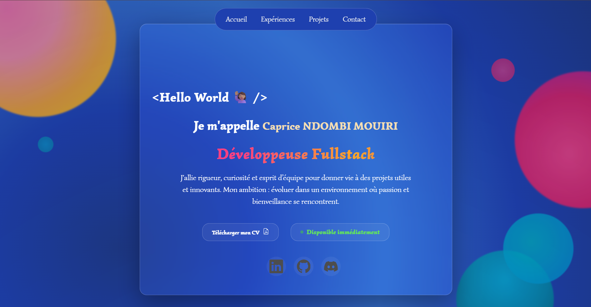

# 🌟 Portfolio – Caprice Hérédya

Mon portfolio personnel développé avec **Angular 21**, conçu pour présenter mes expériences, projets et compétences de manière moderne et responsive.  
Il reflète mon parcours en tant que **Développeuse Fullstack** et met en avant mes réalisations professionnelles et personnelles.  

---

## 🚀 Aperçu



🔗 [Voir le portfolio en ligne](https://caprice-m.dev/)

---

## ✨ Fonctionnalités

- Section **Accueil** avec présentation, téléchargement de mon CV et disponibilités 
- Section **Expériences** (timeline avec détails des missions)
- Section **Projets** (cards glossy avec effets : Code / Demo)
- Section **Contact** (formulaire + infos directes)
- Navigation fluide grâce à Angular Router + fragments
- Design **responsive** 
- Effets **glassmorphism** et **animations CSS**

---

## 🛠️ Stack technique

- [Angular 18](https://angular.dev/) – Framework principal
- [TypeScript](https://www.typescriptlang.org/)
- [SCSS](https://sass-lang.com/) – Styles avancés
- [EmailJS](https://www.emailjs.com/) – Envoi de messages via le formulaire
- Hébergé sur **[Firebase](https://firebase.google.com//)**

---

## 📌 Améliorations prévues

- Ajouter une section blog
- Améliorer le SEO 
- Ajouter des animations plus avancées

---

## 📬 Me contacter

- ✉️ Email : heredyamouiri@gmail.com
- 💼 [LinkedIn](https://www.linkedin.com/in/caprice-ndombi-mouiri-2932011aa/)
- 🐙 [GitHub](https://github.com/Caprice943)

---

## ⚙️ Installation

Clone le projet et installe les dépendances pour le lancer en local :  

```bash
# Cloner le repo
git clone https://github.com/Caprice943/portfolio-hero.git

# Aller dans le dossier
cd portfolio-hero

# Installer les dépendances
npm install

# Lancer le serveur de développement
ng serve

````


#### ✨ Merci d’avoir pris le temps de visiter mon portfolio ! N’hésitez pas à me contacter pour une collaboration ou une opportunité.